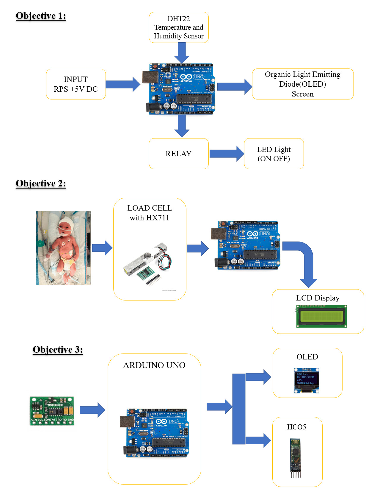
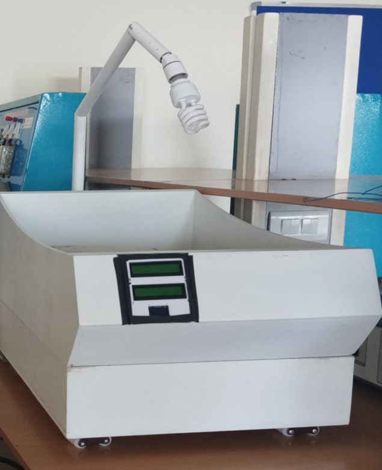

# Portable Neonatal Incubator with Sleep Apnea Monitoring 🍼💤

A low-cost, IoT-enabled neonatal incubator that monitors infant vitals such as
temperature, humidity, and sleep apnea in real-time.

---

## 🧠 Features
- Real-time monitoring using DHT22, MAX30100, and Load Cell  
- Sleep apnea detection via pulse oximetry  
- Cloud data storage using ESP8266 (IoT integration)  
- Compact and portable design for rural healthcare  

---

## 🛠️ Tech Stack
- **Arduino IDE** (C/C++)  
- **ESP8266** WiFi module  
- **Sensors:** DHT22, MAX30100, Load Cell  
- **Display:** OLED  
- **Cloud Platforms:** ThingSpeak / Blynk  

---

## 📊 System Overview

Below is a simplified diagram of the neonatal incubator system.  
It illustrates how the sensors, ESP8266, and cloud platform interact to collect and display real-time infant data.



---

## 👨‍💻 Team

- **Chinthan A D**  
- **Kruthin H K**  
- **N Likitha**  
- **Sanjana B R**  

**Mentor:** *Mr. Shreeshayana R*  
**Institution:** *ATME College of Engineering*  
**Academic Year:** *2025–2026*  

---

## 🔗 Presentation
View the full project documentation [here](docs/slides.pdf).

---

## 📷 Prototype

Below is an image of the actual working prototype of the incubator developed during the project phase.



---

## 📂 Repository Structure
```plaintext
portable-neonatal-incubator/
├─ README.md
├─ LICENSE
├─ .gitignore
├─ B3_Major_Project_Phase_II.pptx
│
├─ docs/
│  ├─ poster.pdf
│  └─ slides.pdf
│
├─ hardware/
│  ├─ bill-of-materials.csv
│  └─ schematics/
│     └─ .gitkeep
│
├─ firmware/
│  └─ arduino/
│     └─ .gitkeep
│
├─ software/
│  └─ web-dashboard/
│     └─ .gitkeep
│
└─ images/
   ├─ cover.png
   ├─ circuit_diagram.png
   └─ model_photo.jpg


## 📘 Contents
- `B3_Major_Project_Phase_II.pptx` — project presentation  
- `docs/` — poster & slides  
- `hardware/` — circuit schematics & BOM  
- `firmware/` — Arduino/ESP code  
- `software/` — IoT dashboard web code  
- `images/` — project cover images
